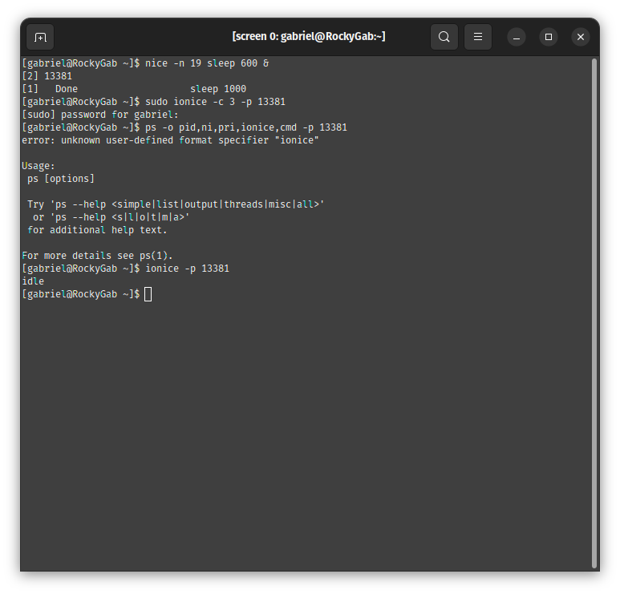
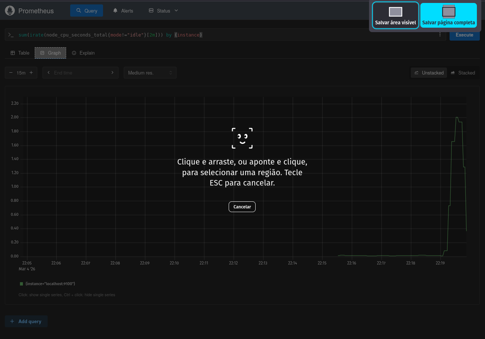
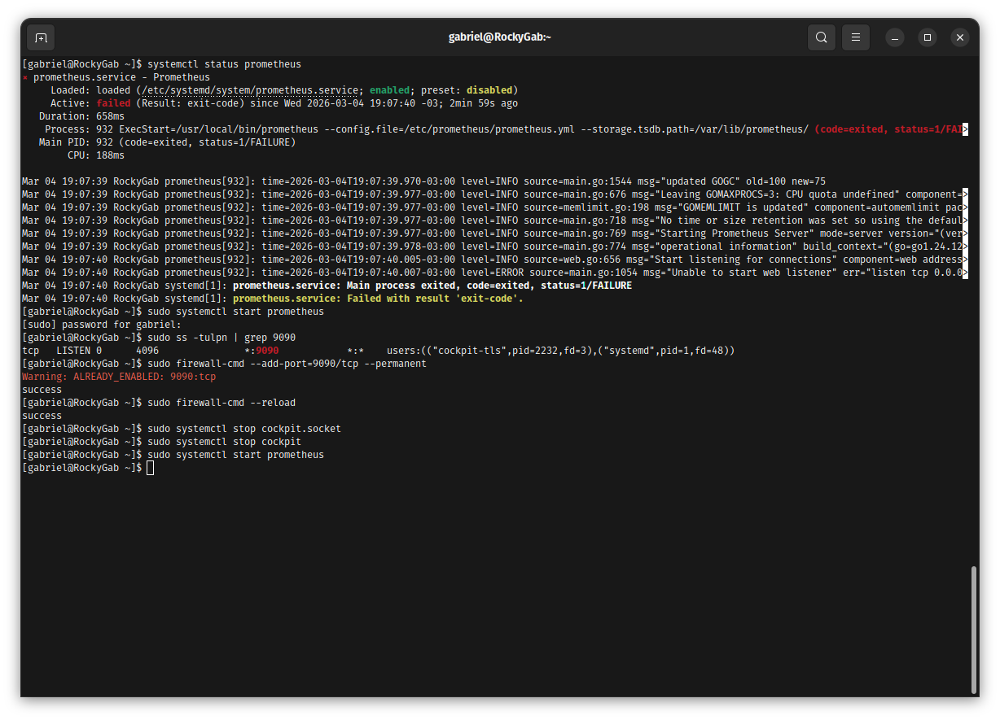
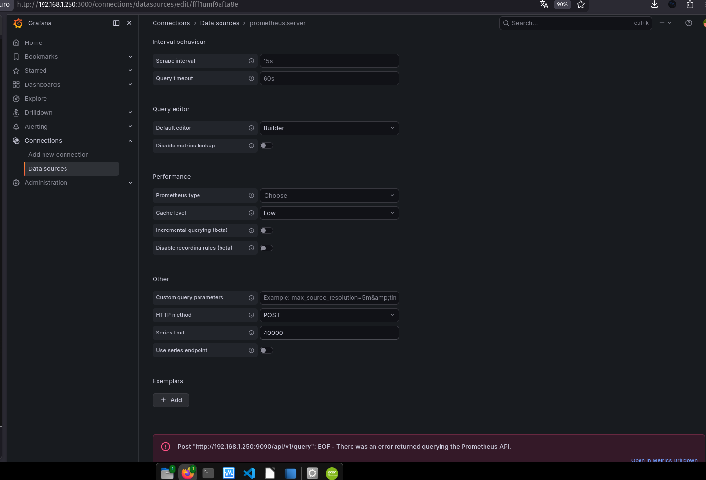
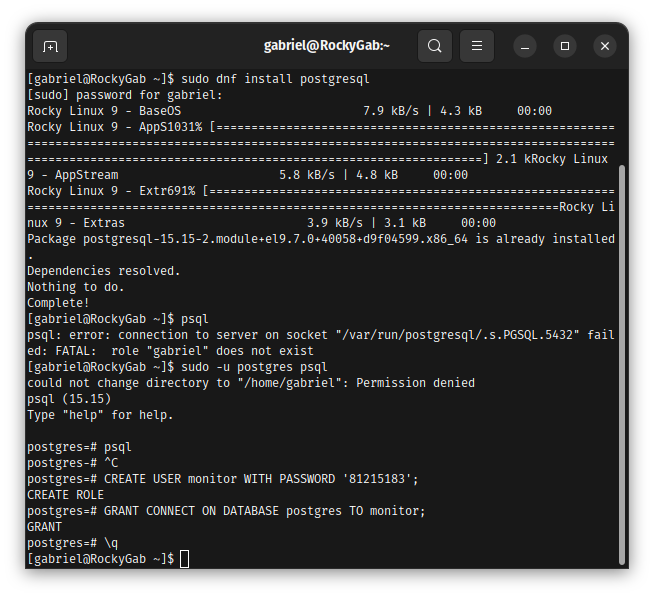
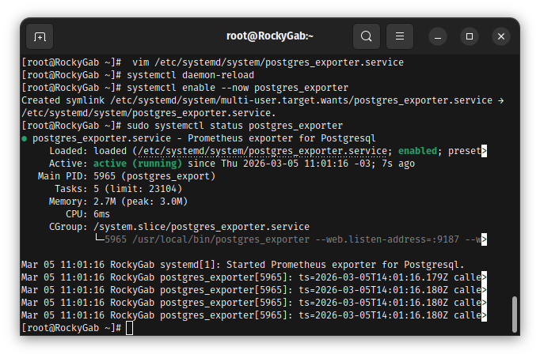
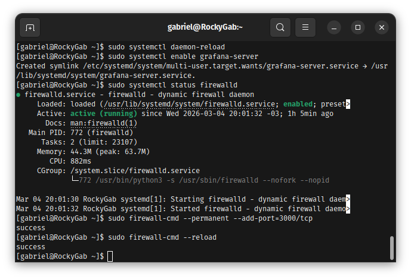
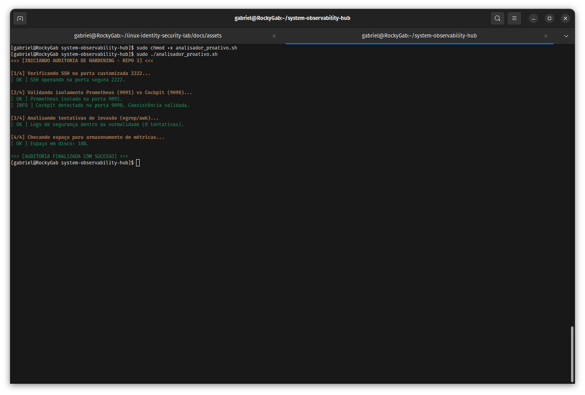

cat << 'EOF' > README.md
# Repo 3: System Health, Observability & Tuning 🛡️

Este repositório documenta a implementação de uma stack de observabilidade de alta performance e a resolução de gargalos críticos. O foco é a aplicação de conceitos de **SRE**, **Tuning de Kernel** e **Hardening**.

---

## Stack Tecnológica
* **Monitoramento:** Prometheus & Node Exporter
* **Visualização:** Grafana
* **Database Health:** PostgreSQL & Postgres Exporter
* **Auditoria:** Lynis & Scripting customizado (`analisador-audit`)

---

## 1. Engenharia de Performance & Tuning
Implementei a priorização de recursos para garantir que a stack de monitoramento tenha precedência sobre processos não críticos.

### Ajuste de Prioridade (Nice/Renice)
Utilizei o escalonador do Kernel para garantir tempo de CPU ao Prometheus e Postgres Exporter.
* **Ação:** Alteração do valor de NI para `-5` (Prioridade Alta) e ajuste de prioridade de I/O via `ionice`.
* **Justificativa Técnica:** O valor `-5` foi definido para evitar o *starvation* (privação de recursos) da stack de métricas durante picos de escrita no PostgreSQL, garantindo que a observabilidade não sofra "gaps" sob carga.
* **Evidência de Tuning:** 

---

## 2. Post-Mortem: Troubleshooting de Conflitos (SRE)
**Evento:** Falha na subida do serviço de métricas (Prometheus).
**Impacto:** 100% de perda de visibilidade da infraestrutura.

### Diagnóstico e Resolução
1. **Identificação:** Identificação do conflito de sockets via `ss -tuln`. O serviço Cockpit estava ocupando a porta padrão `9090`.
2. **Decisão Técnica:** Migração forçada do Prometheus para a porta `9091` e isolamento via flag `--web.listen-address`.
3. **Resultado:** Coleta de métricas restabelecida e coexistência de serviços validada.

📂 Visualizar Evidências de Diagnóstico

* **Conflito Detectado:** 
* **Correção Aplicada:** 

---

## 3. Database Observability (PostgreSQL)
Configuração de exportador dedicado seguindo o princípio de **Least Privilege** (Privilégio Mínimo).

* **Segurança:** Criação do usuário `monitor_user` no Postgres com permissões exclusivas de leitura de métricas (`pg_monitor`).
* **Evidência:** 

---

## 4. Hardening & Auditoria Proativa
Implementação de defesa ativa e automação de auditoria de segurança.

### Gestão de Firewall Moderno (Firewalld)
A gestão de portas foi centralizada no `firewall-cmd` para garantir a persistência das regras de Hardening.
* **Configuração:** SSH movido para a porta `2222/tcp` e monitoramento isolado na `9091/tcp`.
* **Evidência:** 

### Analisador Proativo
Desenvolvimento do script `analisador_proativo.sh` para auditoria contínua de segurança e integridade de rede.
* **Evidência:** 

---

## 📈 Conclusão
O sistema opera com 100% de visibilidade. Todas as decisões técnicas — do Tuning de CPU ao isolamento de rede — foram baseadas em métricas reais e documentadas para garantir a estabilidade do ambiente produtivo.

---
**Licença:** MIT
EOF
