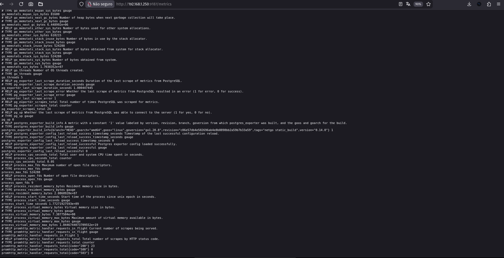
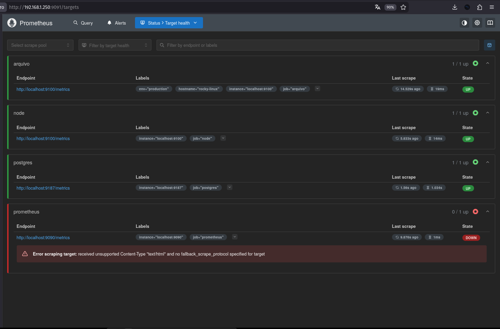

# 🛡️ Repo 3: System Health, Observability & Tuning

> **Objetivo:** Implementação prática de monitoramento de sistema, análise de processos, gestão de logs e resolução de conflitos em ambiente Rocky Linux.

Este repositório documenta a configuração de uma stack de observabilidade e as decisões técnicas tomadas para garantir o funcionamento dos serviços essenciais e da coleta de métricas de um banco de dados PostgreSQL.

---

## 1. Process Analysis & Tuning
Ajuste de prioridade de processos para evitar gargalos de CPU na coleta de métricas. O Prometheus foi configurado com prioridade negativa no Kernel (`nice -5`).

📂 <b>Ver Detalhes do Tuning e Monitoramento</b>

* **Comandos Utilizados:** `nice` e `renice` para ajuste de prioridade, `ionice` para disco.
* **Monitoramento de Pico:** Análise de gargalos utilizando PromQL.
* **Evidência Adicional:** 

---

## 2. Log Management & Auditoria
Criação de um script de auditoria proativa (`analisador_proativo.sh`) para monitorar logs do sistema, mascarar IPs e checar o status de portas críticas.

📂 <b>Ver Evidências de Auditoria</b>

* **Ferramentas:** Uso de `grep`, `awk` e `sed` para extração de dados de `/var/log/secure`.
* **Auditoria Adicional:** Validação de segurança do sistema utilizando o Lynis.
* **Evidências:**
    * [Detecção de Falhas](./docs/assets/automacao_auditoria_detecçao_falhas.png)
    * [Relatório Lynis](./docs/assets/index69_auditoria_hardening_lynis.png)

---

## 3. Modern Monitoring (Prometheus & Grafana)
Configuração da stack de monitoramento para coletar e visualizar a saúde do PostgreSQL e dos recursos da máquina.

📂 <b>Ver Configuração da Stack</b>

* **Banco de Dados:** Criação do usuário `monitor_user` para acesso seguro às métricas.
* **Serviços:** Configuração do `postgres_exporter` rodando via `systemd`.
* **Evidências:**
    * [Configuração do Exporter no Prometheus](./docs/assets/prometheus_config_postgres_exporter.png)
    * [Status do Serviço Systemd](./docs/assets/systemd_postgres_exporter_active_service.png)

---

## 4. Post-Mortem & Troubleshooting
Documentação dos problemas enfrentados durante o laboratório e as soluções aplicadas.

**Incidente Principal: Conflito de Portas (9090)**
O Prometheus falhou ao iniciar pois a porta nativa (9090) já estava em uso pelo Cockpit.

📂 <b>Ver Resolução e Outros Diagnósticos</b>

* **Solução do Conflito:** Reconfiguração do Prometheus para a porta 9091 e liberação no Firewalld.
    * [Correção do Prometheus](./docs/assets/fix-prometheus-cockpit-conflict.png)
* **Outros Erros Resolvidos:**
    * Debug de extração de arquivos: [Erro com comando tar](./docs/assets/debug_file_not_found_tar_fix.png)

---

## 5. Setup Automatizado e Hardening
Script `setup_repo3.sh` criado para padronizar a liberação de portas e permissões no ambiente.

📂 <b>Ver Configuração de Rede</b>

* **Gestão de Firewall Moderno (Firewalld):**
    * Porta 2222 (SSH Customizado)
    * Porta 9090 (Cockpit)
    * Porta 9091 (Prometheus)
    * Porta 3000 (Grafana)
    * Porta 9100 (Node Exporter)
    * Porta 9187 (Postgres Exporter)
* **Gestão de Sessões:** Uso do `screen` para manter processos em background.
    * [Uso do Screen](./docs/assets/gestao-de-sessoes-screen-e-background-jobs.png)

