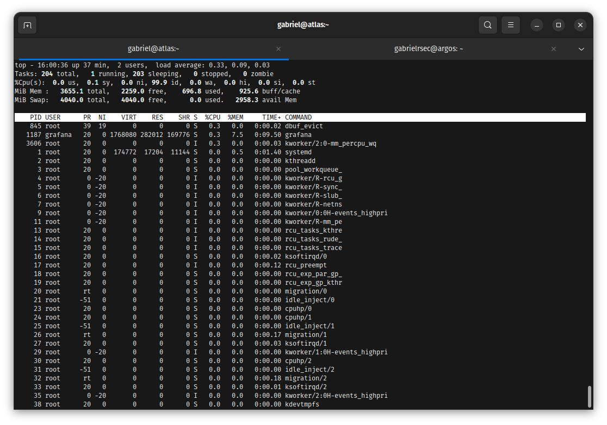
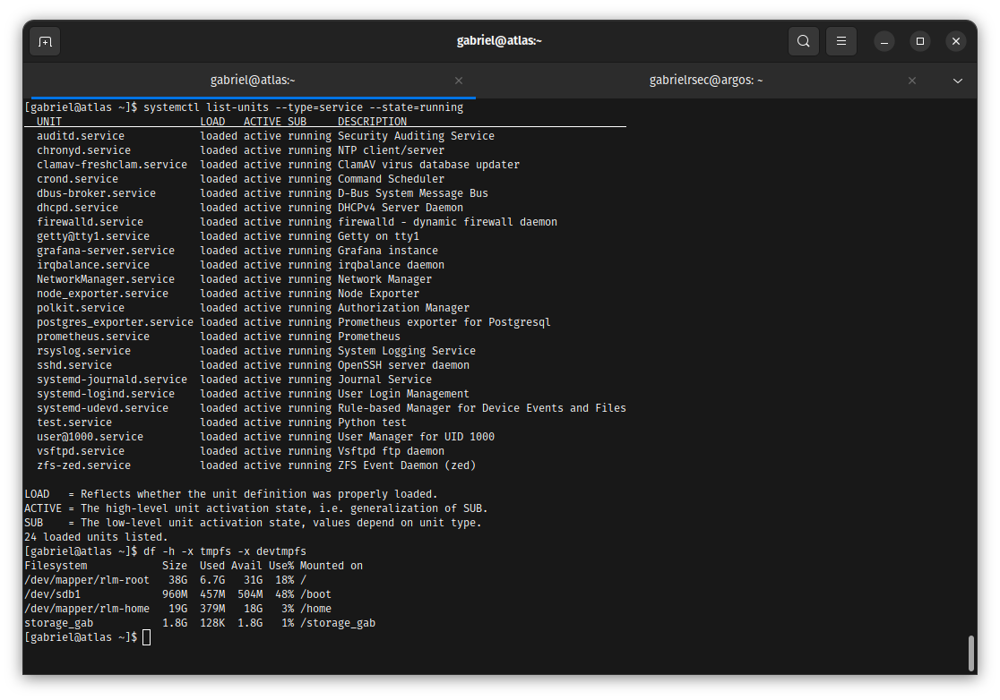
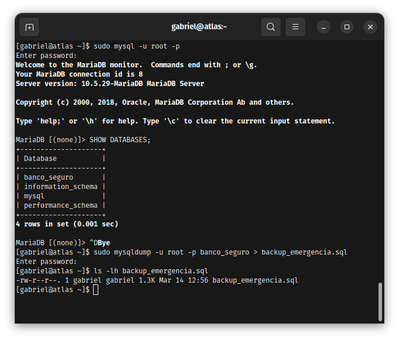
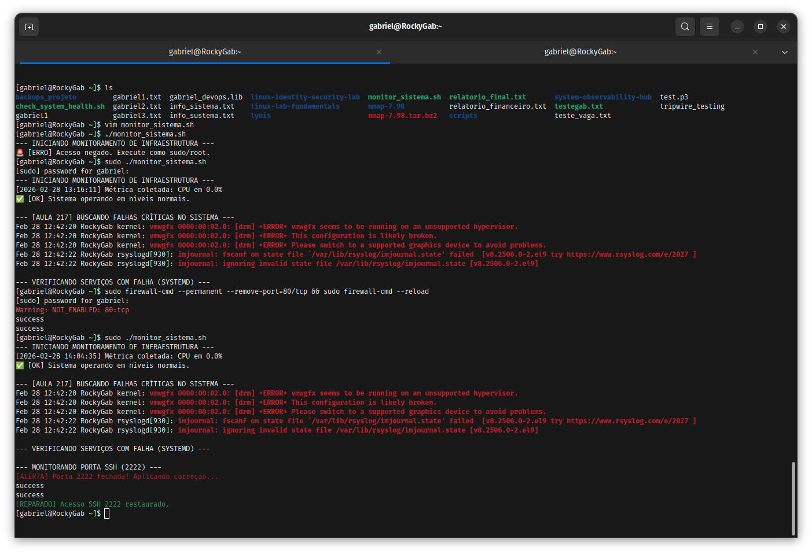

# System Health, Observability & Tuning 🛡️

Este repositório documenta a implementação de uma stack de observabilidade de alta performance e a resolução de gargalos críticos de infraestrutura. O foco é a aplicação prática de conceitos de **SRE (Site Reliability Engineering)**, **Tuning de Kernel** e **Monitoramento Ativo**.

---

## Stack Tecnológica
* **Monitoramento:** Prometheus & Node Exporter
* **Visualização:** Grafana
* **Database Health:** PostgreSQL & Postgres Exporter
* **Auditoria:** Lynis & Scripting customizado (`monitor_sistema.sh`)

---

## 📁 1. Monitoramento de Performance & Recursos (Full View)

### Contexto do Problema
Sistemas de larga escala sofrem degradação silenciosa por falta de correlação de métricas. Era necessário centralizar a visão de consumo de hardware (CPU Load Average) com a saúde dos daemons críticos de segurança.

### Troubleshooting e Resolução
* **Ação Aplicada:** Agrupamento de auditoria de Daemons ativos (Prometheus, Grafana, Auditd e Firewalld) correlacionados com o espaço livre em disco dos pontos de montagem `/` e `/storage_gab` para prevenção de incidentes por *Disk Pressure*.

### Evidência Técnica

  
📂 Clique para ver a performance e auditoria do sistema

  * **System Performance (Top View):** 
  * **Serviços e Disco:** 

---

## 📁 2. Engenharia de Performance & Tuning

### Contexto do Problema
Durante picos de escrita e concorrência no banco de dados PostgreSQL, a coleta de métricas do Prometheus sofria "gaps" (lacunas de dados) por contenção de CPU.

### Troubleshooting e Resolução
Priorização forçada de recursos de hardware para garantir a precedência da stack de monitoramento sobre processos não críticos do sistema operacional.
* **Causa Raiz:** Escalonador padrão do Kernel Linux dando o mesmo peso para processos secundários e de observabilidade.
* **Solução Aplicada:** Alteração do valor de NI (Nice) para `-5` (Prioridade Alta) e ajuste de I/O via `ionice` (Best-effort prioritário).

### Evidência Técnica

  
📂 Clique para ver o Tuning de Processos e Análise PromQL

  * **Gestão de Processos (Nice/Ionice):** 
  * **Análise de Pico via PromQL (irate):** 

---

## 📁 3. Post-Mortem: Troubleshooting de Conflitos (SRE)

### Contexto do Problema
Falha crítica na inicialização do binário do Prometheus impedindo a subida do serviço no ambiente Linux.

### Troubleshooting e Resolução (Hands-on SRE)
1. **Identificação:** Erro de Socket Binding detectado via `ss -tuln` e `journalctl`. O serviço Cockpit do Linux estava utilizando a porta padrão `9090`.
2. **Decisão:** Migração do Prometheus para a porta de escuta `9091` via flag de runtime `--web.listen-address`.
3. **Resultado:** Restabelecimento total da visibilidade da infraestrutura sem colidir com serviços nativos do host.

### Evidência Técnica

  
📂 Clique para ver o Diagnóstico e Correção de Conflito de Porta

  * **Conflito Detectado (Porta 9090):** 
  * **Correção Aplicada (Porta 9091):** 

---

## 📁 4. Database Observability & Disaster Recovery (PostgreSQL)

### Contexto do Problema
Necessidade de expor métricas internas sem expor dados sensíveis e garantir uma estratégia de recuperação rápida em caso de corrupção lógica de dados.

### Troubleshooting e Resolução
* **Monitoramento:** Configuração do exportador dedicado seguindo o princípio de **Least Privilege** via role `pg_monitor`.
* **Resiliência:** Implementação de rotina de **Backup Lógico (Dump)** para garantir o RPO (Recovery Point Objective) e validação da integridade do arquivo.

### Evidência Técnica

  
📂 Clique para ver a criação do usuário e estratégia de backup

  * **Criação do Usuário no SQL:** 
  * **Status do Systemd (Active):** 
  * **Disaster Recovery (Backup Lógico):** 

---

## 📁 5. Automação e Auditoria Proativa (Security Hardening)

### Contexto do Problema
Garantir que as regras de firewall persistam a reinicializações e manter um relatório diário de integridade sem intervenção manual do operador.

### Troubleshooting e Resolução
* **Solução Firewall:** Centralização no `firewall-cmd` para persistência de regras de Hardening bloqueando acessos externos e liberando apenas as portas de monitoramento (2222 e 9091).
* **Solução Scripting:** Desenvolvimento do bash `monitor_sistema.sh` acoplado ao `crontab` para dump de logs estruturados de saúde.

### Evidência Técnica

  
📂 Clique para ver o Firewall e Logs de Auditoria

  * **Hardening de Firewall:** 
  * **Saída do Script Customizado:** 

---

## 📈 Conclusão
A estratégia de observabilidade foi integrada a **Planos de Recuperação de Desastres (DRP)**. Isso garante que métricas de performance e backups lógicos caminhem juntos, reduzindo o **MTTR (Mean Time To Repair)** e protegendo a integridade dos dados contra falhas críticas.

---
**Licença:** MIT
