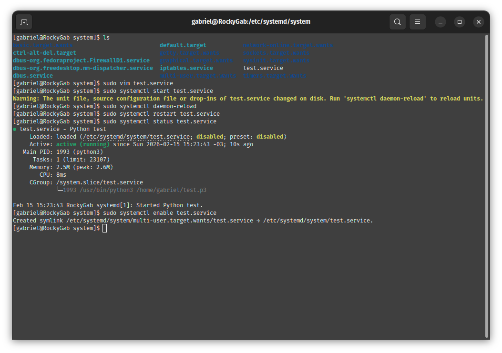

# Repo 3: System Health, Observability & Tuning 📊

Este repositório documenta a implementação de estratégias de sustentação e otimização de sistemas Linux de missão crítica. O foco é a transição do gerenciamento reativo para o proativo, utilizando técnicas avançadas de tuning de performance, automação de serviços e telemetria.

> **💡 Lab Progress & CI/CD:** Este laboratório opera sob o conceito de evolução contínua. A documentação técnica e as evidências laboratoriais são atualizadas sistematicamente conforme o avanço das práticas de engenharia e monitoramento.

---

## Roadmap de Confiabilidade

| Stack Tecnológica | Especialidade Técnica | Status |
| :--- | :--- | :--- |
| **Performance Tuning** | Otimização de Scheduler e I/O (Nice/Ionice) | ✅ Estável |
| **Service Automation** | Orquestração de Ciclo de Vida com Systemd | ✅ Estável |
| **Modern Monitoring** | Telemetria e Dashboards (Prometheus/Grafana) | 🚧 Em Desenvolvimento |
| **Log Governance** | Auditoria de Eventos e Relatórios Post-Mortem | 🚧 Planejado |

---

## Engenharia de Performance & Tuning

### 01. Gestão de Prioridades e Escalonamento
Implementação de políticas de priorização para mitigar contenção de recursos, garantindo que serviços vitais mantenham baixa latência.

*Legenda: Ajuste fino de Nice e Ionice para otimização de CPU e subsistema de disco.*

### 02. Resiliência e Automação de Serviços
Configuração de unidades de serviço autogerenciáveis que garantem a persistência da infraestrutura e recuperação automática de falhas.

*Legenda: Implementação de automação via Systemd para máxima disponibilidade.*

---

## Observabilidade e Diagnóstico Proativo

A integridade do ecossistema é validada através de métricas de telemetria baseadas em evidências reais:

* **Memory Health:** Monitoramento de [Consumo de RAM](docs/assets/monitoramento-ram-persistente-sucesso.png) para prevenção de OOM Killer.
* **I/O & Disk Success:** Validação de [Montagem e Persistência](docs/assets/systemd-service-lsblk-success.png) de sistemas de arquivos.
* **Job Control:** Gestão eficiente de [Sessões e Background Jobs](docs/assets/gestao-de-sessoes-screen-e-background-jobs.png).

---

## 🚀 Próximos Milestones
* Integração de exportadores de métricas para **Prometheus**.
* Elaboração de documentação de **Post-Mortem** baseada em incidentes simulados.

---
*Este repositório reflete minha jornada técnica rumo à excelência em infraestrutura e SRE.*
