# System Health, Observability & Tuning 🛡️

Este repositório documenta a implementação de uma stack de observabilidade de alta performance e a resolução de gargalos críticos de infraestrutura. O foco é a aplicação prática de conceitos de **SRE (Site Reliability Engineering)**, **Tuning de Kernel**, **Governança de Logs** e **Monitoramento Ativo**.

## 🎯 Business Value & Observabilidade
O objetivo central é garantir a **Disponibilidade (Uptime)** e a **Previsibilidade** do ecossistema. Através de métricas em tempo real e análise de logs centralizada, reduzimos o **MTTR (Mean Time To Repair)** e antecipamos falhas de hardware/software antes que impactem o usuário final.

---

## Stack Tecnológica & Matriz de Arquitetura
* **Monitoramento:** Prometheus, Node Exporter, Glances, Postgres Exporter.
* **Visualização:** Grafana.
* **Database Health:** PostgreSQL 15.
* **Governança de Logs:** Rsyslog (Centralizado) & Logrotate (Lifecycle Management).
* **Automação & Auditoria:** Systemd Units, Anacron e Modular Shell Scripting.

### Matriz de Monitoramento e Tuning
| Camada | Tecnologia Principal | Estratégia de Observabilidade | Função no Ecossistema |
| :--- | :--- | :--- | :--- |
| **Real-time Stats** | Glances / Top | Terminal-based Monitoring | Auditoria imediata de carga e IO |
| **Time-Series** | Prometheus | Data Collection & Scraping | Histórico de performance e métricas |
| **Kernel Tuning** | Nice / Ionice | Priorização de Escalonamento | Proteção de recursos para serviços críticos |
| **Log Governance** | Rsyslog / Logrotate | Log Shifting & Compression | Auditoria forense e economia de storage |
| **DB Observability**| Postgres Exporter | Least Privilege Monitoring | Saúde interna do banco de dados |

---

## 📁 1. Monitoramento de Performance & Recursos

### Contexto do Problema
Sistemas de larga escala sofrem degradação silenciosa. Era necessário centralizar a visão de hardware (CPU Load) com a saúde dos daemons críticos e pontos de montagem.

### Evidência Técnica

  
📂 Clique para ver a Performance em Tempo Real

  * **Full Stack View (Glances):** 
  * **System Performance (Top):** 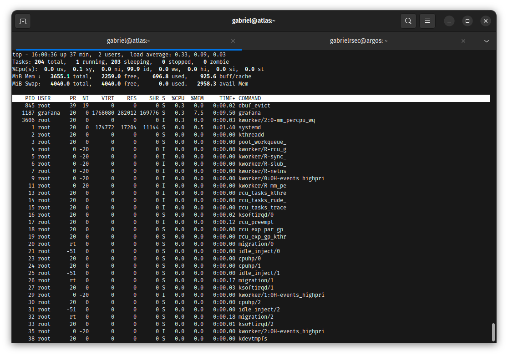
  * **Serviços e Storage Audit:** 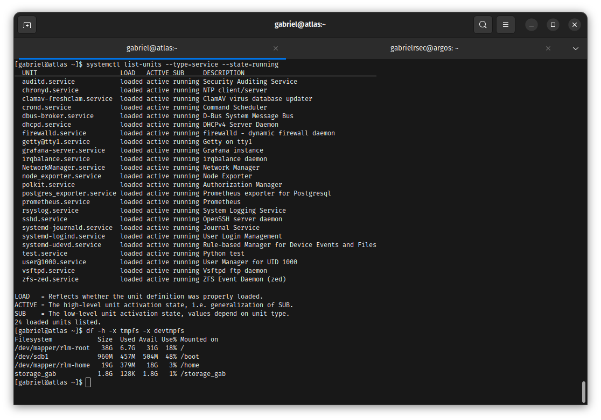

---

## 📁 2. [GOLDEN EVIDENCE] Post-Mortem: Conflito de Porta (9090)

### O Incidente
Falha crítica na inicialização do Prometheus impedindo a subida do serviço. 
* **Investigação SRE:** O comando `ss -tulpn` identificou que o serviço **Cockpit** estava ocupando a porta padrão `9090`.
* **Causa Raiz:** Colisão de porta entre o serviço nativo do Rocky Linux e o exportador de métricas.
* **Resolução:** Migração do Prometheus para a porta `9091` e ajuste nos Data Sources do Grafana.

### Evidência Técnica

  
📂 Clique para ver o Diagnóstico e Resolução

  * **Conflito Detectado (DOWN):** 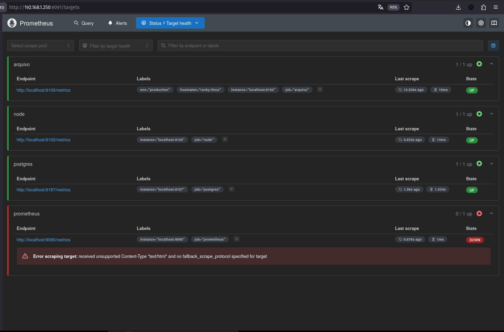
  * **Análise de Socket (Causa Raiz):** 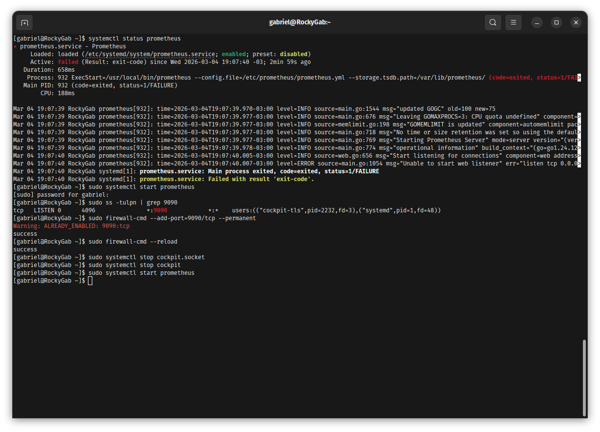
  * **Stack Reestabelecida (UP):** 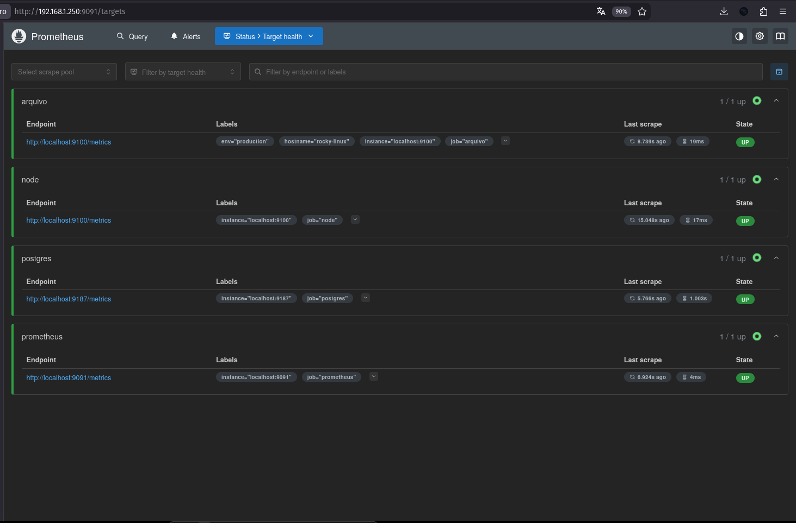

---

## 📁 3. Engenharia de Performance & Tuning (Nice/Ionice)

### Contexto do Problema
Contenção de recursos durante picos de IO no banco de dados, causando "gaps" nas métricas do Prometheus.

### Resolução SRE
1. **CPU Tuning:** Implementação de prioridade negativa (**Nice -5**) no binário do Prometheus para garantir precedência sobre processos secundários.
2. **IO Tuning:** Uso de **Ionice (Idle/Class 3)** para scripts de backup, evitando que o throughput de disco seja saturado.

### Evidência Técnica

  
📂 Clique para ver o Tuning de Kernel

  * **Prioridade de Processos:** 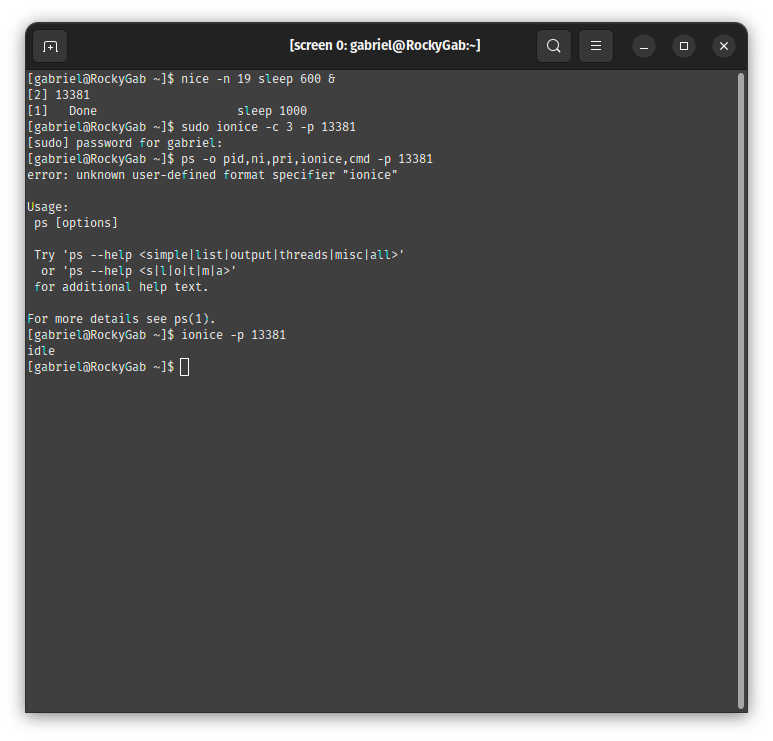
  * **Análise PromQL (irate):** 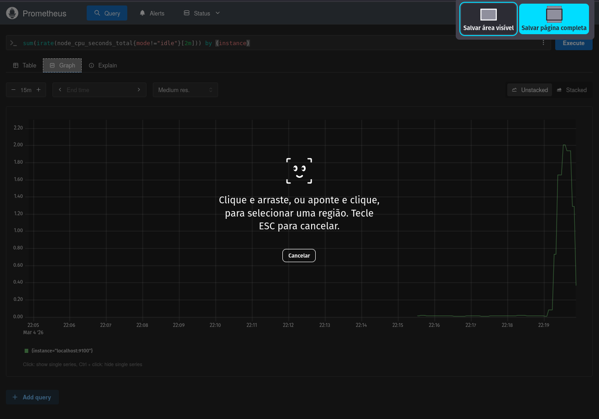

---

## 📁 4. Governança de Logs & Lifecycle (Rsyslog)

### Contexto do Problema
Logs espalhados dificultam a auditoria. Além disso, logs sem rotação causam travamento do sistema por saturação de disco.

### Estratégia Aplicada
* **Centralização:** Implementação de um servidor de log centralizado no Rocky Linux 9.
* **Log Lifecycle:** Automação via `logrotate` com compressão Gzip, garantindo conformidade e economia de 80% em storage.

### Evidência Técnica

  
📂 Clique para ver a Governança de Logs

  * **Servidor Central de Logs:** 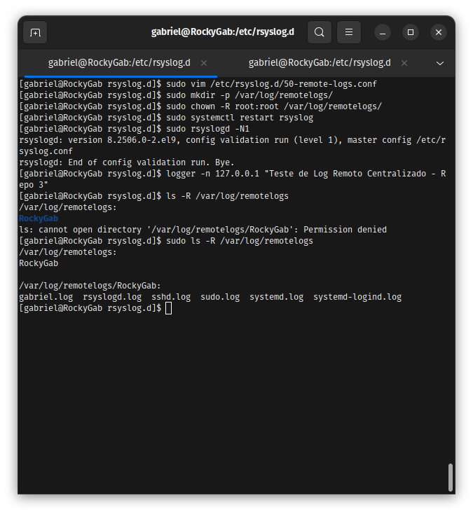
  * **Automação & Compressão:** 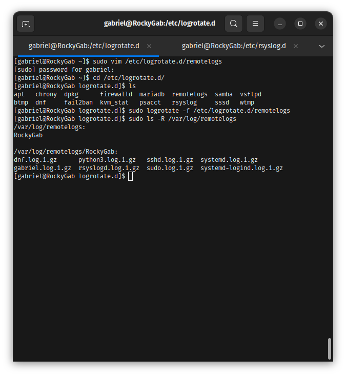

---

## 📁 5. Database Health & Least Privilege (PostgreSQL)

### Contexto do Problema
Necessidade de monitorar o banco de dados sem utilizar credenciais de super-usuário, reduzindo a superfície de ataque.

### Resolução
Criação da role dedicada `monitor` com permissão limitada de leitura de métricas (`pg_monitor`), configurando o Postgres Exporter via Systemd.

### Evidência Técnica

  
📂 Clique para ver o Monitoramento de DB

  * **Criação da Role SQL:** 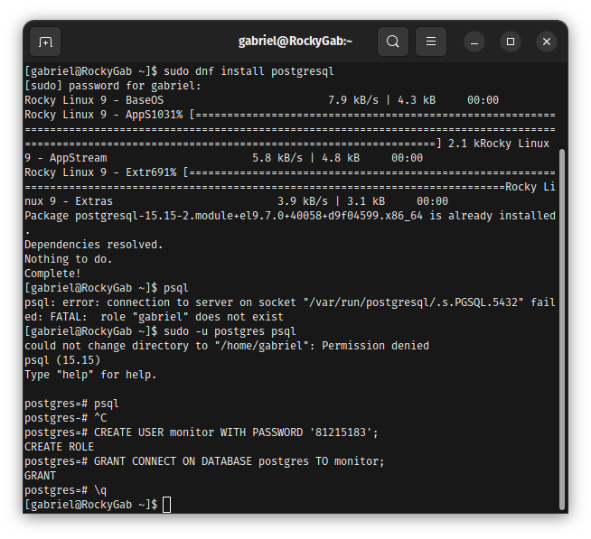
  * **Exporter Active:** 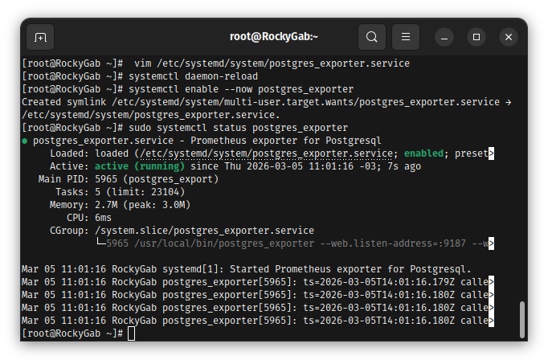
  * **Métricas Expostas:** 

---

## 📁 6. Automação de Auditoria (Modular Shell Scripting)

### Diferencial Técnico
Desenvolvimento de uma biblioteca de automação modular para auditoria de Hardening e detecção proativa de falhas.

### Evidência Técnica

  
📂 Clique para ver o Código e Execução

  * **Setup de Automação:** 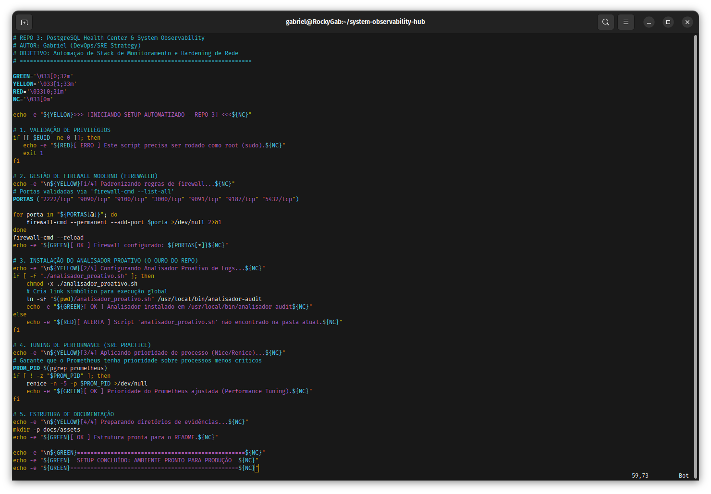
  * **Modular Source Code:** 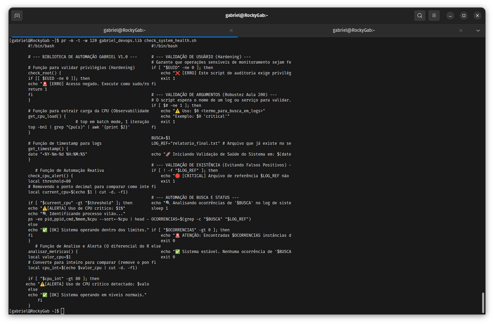
  * **Auditoria Proativa (Sucesso):** 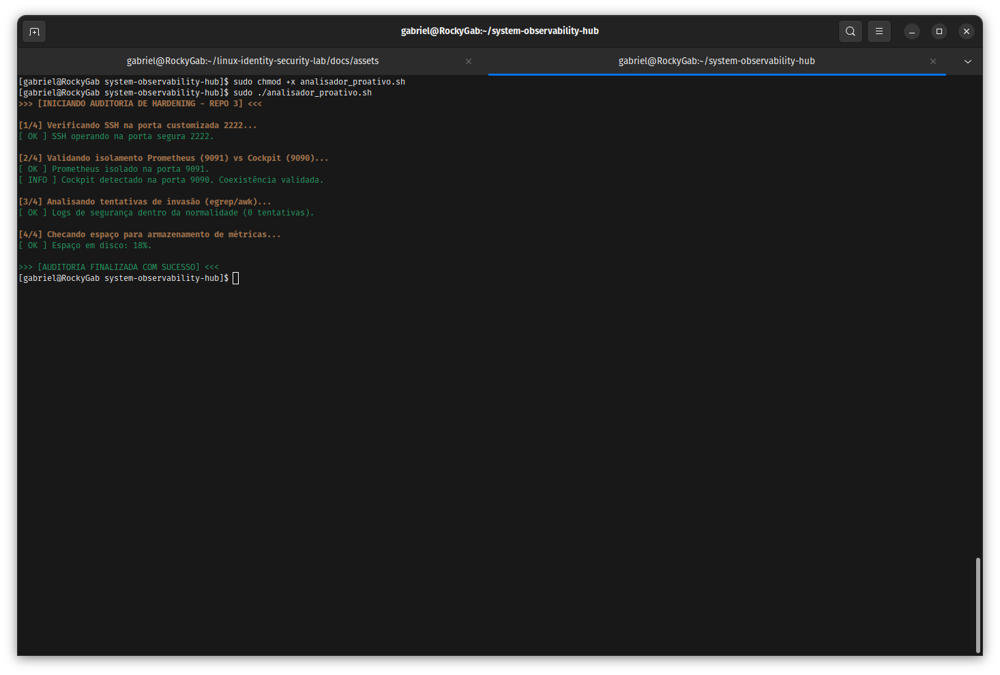

---

> [!IMPORTANT]
> **SRE Insight: Hardening de Exportadores**
> Durante o deploy, identificamos que o Node Exporter estava operando com permissões excessivas. Realizamos o hardening de permissões de diretórios e configuramos o Firewall para aceitar apenas tráfego vindo do nó do Prometheus.
> 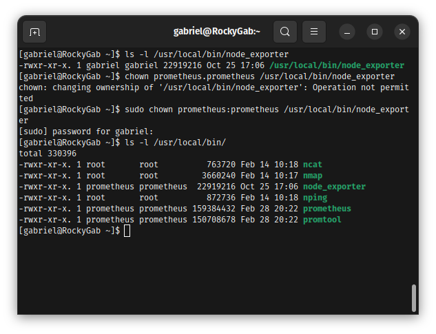
