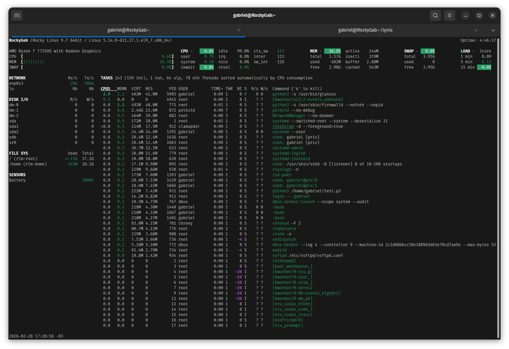
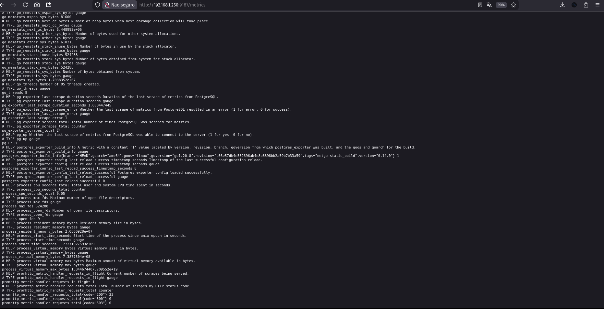

# System Health, Observability & Tuning

Stack prática de observabilidade e operação de infraestrutura, com foco em monitoramento, troubleshooting, tuning e governança de logs.

## Tecnologias

**Prometheus · Grafana · Node Exporter · PostgreSQL · Rsyslog · Logrotate · Systemd · Bash**

---

## Projetos

### Monitoramento de Performance

Monitoramento de recursos, serviços e pontos de montagem utilizando Glances, Top, Prometheus e Grafana.

  
Ver evidências

  
  
  

---

### Post-Mortem: Conflito de Porta

Durante a implantação da stack de observabilidade, o Prometheus não iniciava porque a porta `9090` já estava sendo utilizada pelo Cockpit.

**Investigação:** análise com `ss -tulpn`.  
**Causa raiz:** colisão de serviços na porta padrão.  
**Resolução:** migração do Prometheus para a porta `9091` e ajuste do Data Source no Grafana.

  
Ver investigação e resolução

  
  
  

---

### Performance Tuning

Aplicação de tuning de processos durante contenção de recursos:

- `nice -5` para priorizar o Prometheus.
- `ionice` para reduzir o impacto de tarefas de backup no disco.

  
Ver evidências

  
  

---

### Governança de Logs

Implementação de centralização de logs com Rsyslog e gerenciamento do ciclo de vida utilizando Logrotate com compressão.

  
Ver evidências

  
  

---

### Database Monitoring

Monitoramento do PostgreSQL utilizando uma role dedicada `monitor`, com permissões limitadas via `pg_monitor` e integração do Postgres Exporter ao Systemd.

  
Ver evidências

  
  
  

---

### Automação de Auditoria

Desenvolvimento de uma estrutura modular em Shell Script para auditoria de hardening e detecção proativa de falhas.

  
Ver evidências

  
  
  

---

> **Hardening de Exportadores:** durante o deploy, foram identificadas permissões excessivas no Node Exporter. Foram ajustadas as permissões dos diretórios e restringido o tráfego de rede ao nó Prometheus.

  
Ver evidência

  

